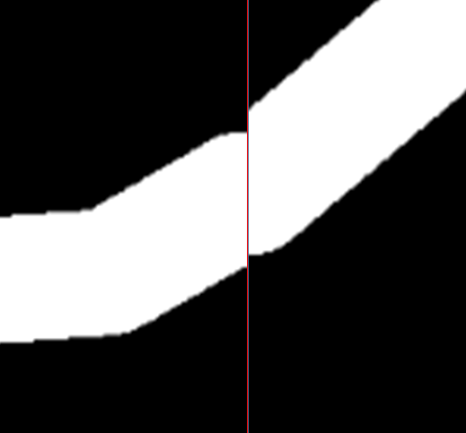

# GraphRenderPrototyp2


Das Programm GraphRenderer2 läd eine JSON Datei welche WGS84 Koordinaten, Wegrelationen, Wegbreiten und Wegbeschaffenheiten enhält. Über eine Tangentialeben werden die WGS84 Koordinaten zu einer planaren Occupancy Grid Map transformiert und diese, je nach Konfiguration als ein oder mehrere PNG Bilder abgespeichert.

## Funktionsweise

Die Knoten des Graphen enthalten GPS Koordienaten welche im WGS84 Koordinatensystem arbeiten. Das WGS84 kodiert in Längengrad und Breitengrad auf der Oberfläche eines Ellipsoiden welcher der Erde angenähert ist.

1. Die WGS84 Koordinaten werden in Karthesische Koordinaten überführt. Hierbei wird der WGS84 Erdellipsoid berückischtigt. Eine Höhenkorrektur findet nicht statt da die benötigten Informationen nicht in den OSM Daten enthalten sind. 

2. Der Punkt ```origin``` an dem die Tangentialebene später aufliegt (Liegt aktuell ungefähr mittig im Clemens-Winkler-Bau) wird invertiert zum Punkt ```base```. Dadurch liegen ```base```, ```M(0,0,0)``` (Erdmittelpunkt) und ```origin``` auf einer Geraden.

3. Es wird eine Tangentialebene ```plane``` am Punkt ```origin``` gebildet.

4. Jeder Knoten auf der Erdoberfläche wird auf die Tangentialebene ```plane``` mittels einer Geraden durch den Punkt ```base``` und dem jeweiligen Knoten projeziert.

5. Alle Knoten des Graphen liegen nun in einer gemeinsamen Ebene im dreidimmensionalen Raum. Um sie zu zweidimmensionalen Koordinaten auf einer Zeichenebene zu überführen werden zwei weitere Geraden innerhalb der Ebene Konstruiert. Dise stützen sich auf die ```Edge``` Werte welche in der Konfiguration festgelegt sind. Es wird nun für jeden Knoten in der Tangentialebene der Abstand zur linken Kante (x) und zur oberen Kante (y) gemessen.

7. Die 2d Koordinaten werden auf einen Canvas überführt und mittels über Linien zu Wegen verknüpft. Hier fließen Wegbreite und Kosten mit ein. Das unterteilen in Subchunks findet noch vor dem eigentlichen zeichnen statt. Dadurch bleibt die Möglichkeit einer späteren Speicheroptimierung offen.

8. Alle Subchunks werden gespeichert (aktuell als PNG). Die Koordinatenoffsets der Subchunks und die zum generieren verwendete Konfiguration wird als JSON im ausgabeordner gespeichert und das Programm beendet.

## Kompilieren

Lazarus mit ObjectPascal ist Platformübergreifend und unterstützt viele Betriebssysteme und Architekturen. Getestet ist es aktuell nur unter Windows. Ubuntu stheht noch an. Am ainfachsten kompiliert man das Projekt über die IDE da sich so auch sehr bequem die Parameter anpassen lassen. Eine Kompilierung über die Komandozeile ist aber ebenfalls möglich.

## Ausführen

Da das Programm Startparameter erwartet lässt es sich nur über die Komandozeile ausführen. Navigiere mit einem Terminal deiner Wahl in das Programmverzeichnis. Mit ```GraphRenderer2.exe -l test_data/default.json -c config.json -s output/ -a ``` wird die Anwendung gestartet, die Konfiguration und Graphen geladen und anschließend in den Ordner ```output``` gerendert. (der Ordner wird nicht automatisch erstellt. Er muss schon vorhanden sein.)

### Startparameter

|Parameter|Parameter (kurz)|Wert|Funktion|
|---|---|---|---|
|```-help```|```-h```||Ruft die Hilfe auf.|
|```-load```|```-l```|```<Pfad zum Graph>```|Übergibt den Pfad zur Graphen Datei.|
|```-config```|```-c```|```<Pfad zur Konfiguration>```|Übergibt die Konfigurationsdatei. Optional, wenn nichts angegeben wird wird standartmäßig ```config.json``` geladen.|
|```-automatic```|```-a```||Verzichtet auf alle Nutzereingaben. So kann das Programm automatisch ausgeführt und nur über die Startparameter gesteuert werden. (**Achtung:** dieser Parameter sollte als letztes angestellt werden. Andernfalls führt er zu einen Fehler in der Ausführung. Der Bug ist bekannt.)|
|```-save```|```-s```| ```<Pfad zum Ausgabeordner>``` |Gibt den Ausgabeordner innerhalb des Programverzeichnisses an.|

## Konfiguration

Allein aus den OSM Daten kann noch keine OGM generiert werden. Um Kontrolle über die Ausgabe und Anpassbarkeit zu erhalten wird eine Konfigurationsdatei geladen. Diese ist im JSON Vormat verfasst und hat folgenden Aufbau:

    {
        "WGS84":{
            "semi-major-axis":"6378137.0",
            "semi-minor-axis":"6356752.314245",
            "flattening":"298.257223563",
            "baseunit":"m"
        },
        "plane":{
            "origin":{
                "WGS84":{
                    "lat":"50.9248529",
                    "lon":"13.3323959"
                }
            },
            "edge":{
                "WGS84":{
                    "north_lat":"50.9263889",
                    "south_lat":"50.9230556",
                    "west_lon":"13.326666666666666",
                    "east_lon":"13.336388888888889"
                }
            }
        },
        "output":{
            "pixelwidth":"0.01",
            "subchunksize":"10"
        }
    }

### Erklärung der einzelnen Parameter

| Schlüssel | Einheit | Bedeutung |
| --- | --- | --- |
| ```WGS84/semi-major-axis``` | ```baseunit```  | Radius in der XY-Ebene des Erdellipsoiden. |
| ```WGS84/semi-minor-axis``` | ```baseunit```  | Radius in der Z-Achse des Erdellipsoiden. |
| ```WGS84/flattening``` | ```(baseunit)```  | Abplattung des Erdellipsoiden. Wird aktuell nicht verwendet und kan ggf. auch aus den vorrangegangenen beiden Werten berechnet werden. |
| ```WGS84/baseunit``` | Einheit aller Werte. Vorzugsweise in Meter. | Radius in der Z-Achse des Erdellipsoiden. |
| ```plane/origin/WGS84/lon``` | ```°```  | Längengrad des Auflagepunkts der Tangentialebene. |
| ```plane/origin/WGS84/lat``` | ```°```  | Breitengrad des Auflagepunkts der Tangentialebene. |
| ```plane/edge/WGS84/north_lat``` | ```°```  | Längengrad der nördlichen Kartenkante. |
 ```plane/edge/WGS84/south_lat``` | ```°```  | Längengrad der südlichen Kartenkante. (Keine feste Grenze da die Karte dynamisch in +x und +y Richtung erweitert wird. Dennoch notwendig für die Koordinatentransformation.) |
|```plane/edge/WGS84/west_lon``` | ```°```  | Breitengrad der westlichen Kartenkante. |
| ```plane/edge/WGS84/east_lon``` | ```°```  | Breitengrad der östlichen Kartenkante. (Keine feste Grenze da die Karte dynamisch in +x und +y Richtung erweitert wird. Dennoch notwendig für die Koordinatentransformation.)  |
| ```output/pixelwidth``` | ```baseunit```  | Breite und Höhe eines Pixel. |
| ```output/subchunksize``` | ```baseunit```  | Breite und Höhe eines Subchunks. |


**Achtung:** Es wird nicht geprüft ob ein Knoten innerhalb des Renderbereiches liegt. Daher sollten alle Knoten innerhalb des Bereichs liegen. Ist dem nicht so kann es zu Fehlern in der Karte oder zu einen Abbbruch des Programms kommen.


## Bekannte Bugs und fehlerhaftes Verhalten

- Zu hohe Auflösungen (kleine Pixelbreiten) in Verbindung mit großen subchunks führen zu einen ```OutOfMemoryError```. Das ist eine Limitierung der Zeichenbibliothek allerdings bei realistischen Auflößungen kein Problem.
- Diagonale Wege werden an der Fügestelle zwischen zwei Subchunks nicht korrekt dargestellt (siehe unten). Das liegt and der Art wie diese aktuell gezeichnet werden. Eine mögliche Lösung wäre das zeichnen von Kreuzen anstatt von Kreisen. 
- Die Reinfolge der Parameter kann nicht beliebig sein. Bestimmte Kombinationen funktionieren nicht. (Das oben genannte Befehl funktioniert.)




### Quellen

[WGS84](https://confluence.qps.nl/qinsy/latest/en/world-geodetic-system-1984-wgs84-182618391.html)